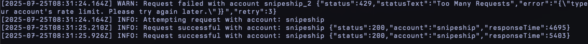
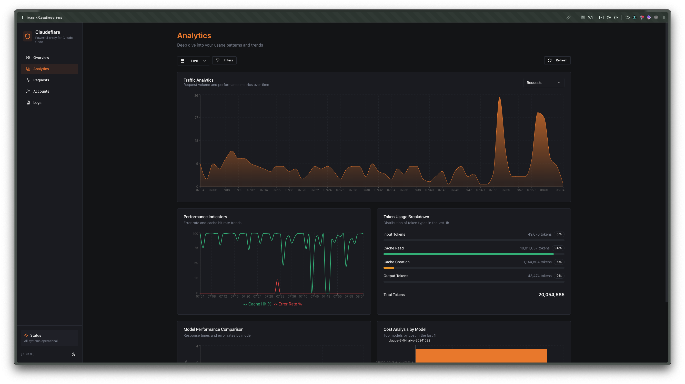

# better-ccflare 🛡️
[](https://github.com/hesreallyhim/awesome-claude-code)

**Track Every Request. Go Low-Level. Never Hit Rate Limits Again.**

The ultimate Claude API proxy with intelligent load balancing across multiple accounts. Full visibility into every request, response, and rate limit.

https://github.com/user-attachments/assets/c859872f-ca5e-4f8b-b6a0-7cc7461fe62a


## Why better-ccflare?

- **🚀 Zero Rate Limit Errors** - Automatically distribute requests across multiple accounts
- **🤖 Multi-Provider Support** - Claude OAuth, Claude API console, Vertex AI, AWS Bedrock, NanoGPT, z.ai, Minimax, OpenRouter, Kilo, Codex (OpenAI OAuth), xAI/Grok, Anthropic-compatible, and OpenAI-compatible providers
- **🔒 OAuth Token Health** - Real-time monitoring of OAuth token status with automatic refresh and health indicators
- **🔗 Custom API Endpoints** - Configure custom endpoints for Anthropic accounts for enterprise deployments
- **☁️ OpenAI-Compatible Support** - Use OpenAI-compatible providers like OpenRouter, Together AI, and more with Claude API format
- **🧩 Codex / Responses API Compatibility** - `POST /v1/responses` and `POST /v1/responses/compact` are translated to Anthropic `/v1/messages`
- **🔄 Smart Auto-Fallback** - Automatically switch back to preferred accounts when their rate limits reset
- **⚡ Auto-Refresh** - Automatically start new usage windows when rate limits reset with 30-minute buffer
- **📊 Request-Level Analytics** - Track latency, token usage, and costs in real-time with optimized batch processing
- **🔍 Deep Debugging** - Full request/response logging and error traces
- **🔐 API Authentication** - Optional API key authentication with secure key management
- **⚡ <10ms Overhead** - Minimal performance impact with lazy loading and request deduplication
- **🛡️ Security Hardened** - Critical security fixes for authentication bypass, command injection, and credential leakage
- **💸 Free & Open Source** - Run it yourself, modify it, own your infrastructure

### Why this fork?

This project builds upon the excellent foundation of [snipeship/ccflare](https://github.com/snipeship/ccflare) with significant enhancements:

**🎯 Core Improvements (v3.0.0):**
- **Enhanced Security** - Critical fixes for authentication bypass, command injection, and PKCE implementation
- **OAuth Token Health Monitoring** - Real-time status indicators and automatic token refresh with 30-minute buffer
- **Extended Provider Support** - AWS Bedrock, NanoGPT (with dynamic pricing), Minimax, OpenRouter, Kilo, Codex (OpenAI OAuth), xAI/Grok, Anthropic-compatible, and OpenAI-compatible providers
- **Simplified Load Balancing** - Removed tier system for O(1) priority-based selection
- **Real-time Analytics Dashboard** - Beautiful web UI with fixed request history (no disappearing requests)
- **Package Distribution** - Available via npm and bun for easy installation

**🛠️ Developer Experience:**
- **Powerful CLI** - Complete command-line interface for account management and configuration
- **REST API** - Complete API for automation and integration
- **Cross-Platform Binary** - Pre-compiled binary works with Node.js or Bun
- **Comprehensive Logging** - Request/response tracking with searchable history
- **Database Integration** - SQLite (default) or PostgreSQL for persistent storage and analytics, supporting Kubernetes multi-pod deployments

**📦 Distribution & Updates:**
- **npm/bun Registry** - Install with `npm install -g better-ccflare` or `bun install -g better-ccflare`
- **npx/bunx Support** - Run without installation: `npx better-ccflare` or `bunx better-ccflare`
- **Smart Update Detection** - Web UI detects package manager and shows appropriate update commands
- **Version Management** - Semantic versioning with automatic update notifications

**🏢 Production Ready:**
- **Enterprise Features** - Custom API endpoints, session management, advanced analytics
- **Performance Optimized** - <10ms overhead with request deduplication and caching
- **Reliability** - Automatic error recovery, circuit breakers, and health monitoring
- **Scalability** - Built for high-throughput production environments
- **PostgreSQL Support** - Set `DATABASE_URL=postgresql://...` to use PostgreSQL for Kubernetes multi-pod deployments where SQLite file-sharing is not feasible

## Quick Start

### Install via npm (Linux x86_64)

```bash
npm install -g better-ccflare

# Start better-ccflare (Server + Dashboard)
better-ccflare
```
Continue to [Configure Claude SDK](https://github.com/tombii/better-ccflare#configure-claude-sdk).

**⚠️ Windows npm Installation Issue**: If you installed via npm on Windows and encounter a path error like `"C:\\Program Files\\nodejs\\\\node_modules\\better-ccflare\\dist\\better-ccflare" is either misspelled or could not be found`, this is a known [npm bug on Windows](https://github.com/npm/cli/issues/969) affecting how npm generates wrapper scripts. See [Windows Troubleshooting](#windows-troubleshooting) for workarounds.
### Install via bun

```bash
bun install -g better-ccflare

# Start better-ccflare (Server + Dashboard)
better-ccflare
```
Continue to [Configure Claude SDK](https://github.com/tombii/better-ccflare#configure-claude-sdk).
### Install Pre-compiled Binary (All Architectures)

Download the appropriate binary for your platform from [GitHub Releases](https://github.com/tombii/better-ccflare/releases/latest):

#### Linux x86_64
```bash
wget https://github.com/tombii/better-ccflare/releases/latest/download/better-ccflare-linux-amd64
chmod +x better-ccflare-linux-amd64
./better-ccflare-linux-amd64
```
Continue to [Configure Claude SDK](https://github.com/tombii/better-ccflare#configure-claude-sdk).
#### Linux ARM64 (Raspberry Pi 3/4/5, Oracle Cloud ARM, AWS Graviton)
```bash
wget https://github.com/tombii/better-ccflare/releases/latest/download/better-ccflare-linux-arm64
chmod +x better-ccflare-linux-arm64
./better-ccflare-linux-arm64
```
Continue to [Configure Claude SDK](https://github.com/tombii/better-ccflare#configure-claude-sdk).
#### macOS Intel
```bash
curl -L -o better-ccflare-macos-x86_64 https://github.com/tombii/better-ccflare/releases/latest/download/better-ccflare-macos-x86_64
chmod +x better-ccflare-macos-x86_64

# Remove quarantine attribute (required on macOS to run unsigned binaries)
xattr -d com.apple.quarantine better-ccflare-macos-x86_64

./better-ccflare-macos-x86_64
```
Continue to [Configure Claude SDK](https://github.com/tombii/better-ccflare#configure-claude-sdk).
#### macOS Apple Silicon
```bash
curl -L -o better-ccflare-macos-arm64 https://github.com/tombii/better-ccflare/releases/latest/download/better-ccflare-macos-arm64
chmod +x better-ccflare-macos-arm64

# Remove quarantine attribute (required on macOS to run unsigned binaries)
xattr -d com.apple.quarantine better-ccflare-macos-arm64

./better-ccflare-macos-arm64
```
Continue to [Configure Claude SDK](https://github.com/tombii/better-ccflare#configure-claude-sdk).

**macOS Gatekeeper Notice:** Our macOS binaries are not notarized by Apple as this requires a paid Apple Developer subscription. After downloading, you must remove the quarantine attribute using the `xattr` command shown above to run the binary. If you prefer not to run unsigned binaries, you can [install from source](#install-from-source) instead.

#### Windows x86_64
Download [`better-ccflare-windows-x64.exe`](https://github.com/tombii/better-ccflare/releases/latest/download/better-ccflare-windows-x64.exe) and run it.
Continue to [Configure Claude SDK](https://github.com/tombii/better-ccflare#configure-claude-sdk).
### Run without installation (npx/bunx)

```bash
# Run with npx (downloads and executes latest version)
npx better-ccflare@latest

# Run with bunx (faster for bun users)
bunx better-ccflare@latest
```
Continue to [Configure Claude SDK](https://github.com/tombii/better-ccflare#configure-claude-sdk).
### Install from source

```bash
# Clone and install
git clone https://github.com/tombii/better-ccflare
cd better-ccflare
bun install

# Build dashboard (required before first run)
bun run build

# Start better-ccflare (TUI + Server)
bun run better-ccflare
```
Continue to [Configure Claude SDK](https://github.com/tombii/better-ccflare#configure-claude-sdk).

**Note**: You must run `bun run build` at least once to build the dashboard files before starting the server. This can also be done by running `bun run better-ccflare` which includes the build step.

### Environment Variables

better-ccflare supports several environment variables for configuration. The most commonly used ones:

```bash
# Server Configuration
PORT=8080                              # Server port (default: 8080)
BETTER_CCFLARE_HOST=0.0.0.0           # Server binding host (default: 0.0.0.0, use 127.0.0.1 for localhost-only)
CLIENT_ID=your-client-id              # OAuth client ID
BETTER_CCFLARE_CONFIG_PATH=/path/to/config.json  # Custom config location
BETTER_CCFLARE_DB_PATH=/path/to/database.db  # Custom database path (default: ~/.config/better-ccflare/better-ccflare.db)
                                       # Use this for development/testing with a separate database

# Logging and Debugging
LOG_LEVEL=INFO                         # Log level (ERROR, WARN, INFO, DEBUG)
LOG_FORMAT=json                        # Log format (json or text)
better-ccflare_DEBUG=0                  # Enable debug mode (1 for enabled)

# SSL/TLS Configuration
SSL_KEY_PATH=/path/to/key.pem          # SSL private key path (for HTTPS)
SSL_CERT_PATH=/path/to/cert.pem        # SSL certificate path (for HTTPS)

# Load Balancing
LB_STRATEGY=session                    # Load balancing strategy (default: session)
SESSION_DURATION_MS=18000000           # Session duration in milliseconds (5 hours)

# Retry Configuration
RETRY_ATTEMPTS=3                       # Number of retry attempts
RETRY_DELAY_MS=1000                   # Initial retry delay in milliseconds
RETRY_BACKOFF=2                        # Retry backoff multiplier

# Storage
STORE_PAYLOADS=false                   # Disable storing request/response bodies (reduces DB size and memory usage)
                                       # Token counts, costs, model, status and timing are still recorded
```

**Security Notes**:
- Use `BETTER_CCFLARE_HOST=127.0.0.1` to bind only to localhost for better security
- Never commit `.env` files containing sensitive values to version control
- Use environment-specific configuration for production deployments

📖 **See [docs/configuration.md](docs/configuration.md) for the complete list** — overload/rate-limit retry tuning, health endpoint detail, agent discovery, payload encryption at rest, model catalog refresh, PostgreSQL pooling, Codex prompt-cache keys, and more.

### Using .env Files

better-ccflare automatically supports `.env` files for easy configuration management. You can create a `.env` file in your project directory:

```bash
# Copy the example .env file
cp .env.example .env
# Edit with your configuration
nano .env
```

**Supported across all deployment methods**:
- **CLI Binary**: Automatically loads `.env` from current working directory
- **Docker Compose**: Automatically loads `.env` from the same directory as `docker-compose.yml`
- **Docker**: Mount your `.env` file or pass variables directly

**Example `.env` file**:
```bash
# Server Configuration
PORT=8080

# SSL/TLS Configuration (optional)
SSL_KEY_PATH=/path/to/ssl/key.pem
SSL_CERT_PATH=/path/to/ssl/cert.pem

# Load Balancing
LB_STRATEGY=session

# Logging and Debugging
LOG_LEVEL=INFO
LOG_FORMAT=pretty

# Database configuration
DATA_RETENTION_DAYS=3
REQUEST_RETENTION_DAYS=90

# Storage (set to false to skip storing request/response bodies, reducing DB size and memory pressure)
STORE_PAYLOADS=true
```

**Usage with different deployment methods**:
```bash
# CLI (binary or local development)
better-ccflare --serve

# Docker Compose (place .env alongside docker-compose.yml)
docker-compose up

# Docker (mount .env file)
docker run -v $(pwd)/.env:/app/.env:ro -p 8080:8080 ghcr.io/tombii/better-ccflare:latest
```

### Docker (Multi-Platform: linux/amd64, linux/arm64)

```bash
# Quick start with docker-compose
curl -O https://raw.githubusercontent.com/tombii/better-ccflare/main/docker-compose.yml

# Optional: Create and configure .env file
cp .env.example .env
# Edit .env with your settings (SSL, port, etc.)
nano .env

# Start with docker-compose (automatically loads .env file)
docker-compose up -d

# Or use docker run with environment variables
docker run -d \
  --name better-ccflare \
  -p 8080:8080 \
  -v better-ccflare-data:/data \
  -e SSL_KEY_PATH=/path/to/ssl/key.pem \
  -e SSL_CERT_PATH=/path/to/ssl/cert.pem \
  ghcr.io/tombii/better-ccflare:latest

# View logs
docker logs -f better-ccflare
```

Once the container is running, **open http://localhost:8080 in your browser** to add and manage accounts through the Web UI. This is the recommended way — using `docker exec` to run CLI commands inside the container won't work for OAuth-based account modes since the container has no browser.

**🆕 Environment Variable Support**: Docker Compose now automatically loads `.env` files from the same directory as `docker-compose.yml`. Simply create a `.env` file alongside your `docker-compose.yml` file and the container will use those settings.

**Available Docker tags:**
- `latest` - Latest stable release
- `main` - Latest build from main branch
- `1.2.28`, `1.2`, `1` - Specific version tags
- `sha-abc123` - Commit-specific tags

See [DOCKER.md](DOCKER.md) for detailed Docker documentation.

### Systemd Deployment

For running better-ccflare as a native systemd service on Linux (without Docker), see the [Systemd Deployment Guide](docs/systemd.md). It covers unit file configuration, memory management with `--smol`, restart policies, and a preflight script that prevents `BUN_JSC_*` environment variable crashes.

## Configure Claude SDK

### Option 1: Using Claude CLI with OAuth (Recommended if you have Claude Pro/Team)

If you have a Claude Pro or Team subscription and are logged into Claude CLI:

```bash
# Set only the base URL - no API key needed!
export ANTHROPIC_BASE_URL=http://localhost:8080

# Make sure to configure your accounts in the better-ccflare dashboard

# Start Claude CLI (uses your existing login)
claude
```

**Important:** When using Claude CLI with an active OAuth login, do **NOT** set `ANTHROPIC_AUTH_TOKEN`. Setting both will trigger a warning from Claude CLI about conflicting authentication methods.

### Option 2: Using API Key Authentication

If you're NOT using Claude CLI's OAuth login, or prefer API key authentication:

```bash
# First, logout from Claude CLI if you're currently logged in
claude /logout

# Then set both the base URL and API key
export ANTHROPIC_BASE_URL=http://localhost:8080

# If better-ccflare has NO API keys configured (open access):
export ANTHROPIC_AUTH_TOKEN=dummy-key

# If better-ccflare HAS API keys configured (protected):
# Generate a key first: better-ccflare --generate-api-key "My VPS"
export ANTHROPIC_AUTH_TOKEN=btr-abcdef1234567890...  # Use your real better-ccflare API key

# Make sure to configure your accounts in the better-ccflare dashboard

# Start Claude CLI
claude
```

### Option 3: Remote/Headless VPS Setup (Secure Proxy)

Use better-ccflare on a trusted server to avoid storing OAuth credentials on untrusted/temporary machines:

**On your trusted server (running better-ccflare):**
```bash
# Add your Claude account with OAuth
better-ccflare --add-account myaccount --mode claude-oauth --priority 0

# Generate an API key for remote access
better-ccflare --generate-api-key "Remote VPS"
# Save the generated key: btr-abcdef1234567890...

# Start the server (ensure it's accessible remotely)
better-ccflare --serve
```

**On your untrusted/temporary VPS:**
```bash
# Set the remote better-ccflare URL and API key
export ANTHROPIC_BASE_URL=https://your-server.com:8080
export ANTHROPIC_AUTH_TOKEN=btr-abcdef1234567890...  # Your better-ccflare API key

# Start Claude CLI (no need to login - better-ccflare handles auth)
claude
```

**How it works:**
- Claude Code CLI sends requests with your better-ccflare API key
- better-ccflare validates the API key and proxies requests using its stored OAuth credentials
- Your OAuth credentials stay secure on your trusted server
- You can use Claude Code on any machine without storing sensitive credentials

### Which method should I use?

- **Have Claude Pro/Team and working locally?** Use Option 1 (OAuth only) - simpler and no API key needed
- **Working on untrusted/temporary machines?** Use Option 3 (Remote VPS setup) - keeps credentials secure
- **Using only API keys in better-ccflare?** Use Option 2 (logout + API key)
- **Getting auth conflict warnings?** You have both methods active - choose one and follow its steps above

### Codex CLI as a Client

better-ccflare supports [Codex CLI](https://github.com/openai/codex) as a client. Codex speaks the OpenAI Responses API; better-ccflare intercepts requests to `/v1/responses` and `/v1/responses/compact` and translates them to Anthropic `POST /v1/messages` internally, routing through your configured account pool.

Configure Codex CLI to point at better-ccflare in `~/.codex/config.toml`:

```toml
openai_base_url = "http://127.0.0.1:8080/v1"
```

Note: use `127.0.0.1` instead of `localhost` — Codex CLI has a known issue where `localhost` resolves to IPv6 first and causes connection failures. The `/v1` suffix is required; Codex appends `/responses` to the base URL.

Or via environment variables:

```bash
export OPENAI_BASE_URL=http://127.0.0.1:8080/v1
export OPENAI_API_KEY=dummy-key
```

Codex CLI requires an API key to start — use `dummy-key` if better-ccflare API key authentication is not enabled, or your real better-ccflare API key if it is.

Known limitations:

- `previous_response_id` is accepted but ignored — Codex uses this only over WebSocket; for regular HTTP requests it always sends the full conversation history in `input`
- Built-in tool types (`web_search_preview`, `code_interpreter`, `file_search`) are silently skipped; only `type: "function"` tools are forwarded to Anthropic
- Claude OAuth accounts (Claude Pro/Team, `provider=anthropic` with OAuth tokens) are automatically excluded from Codex CLI traffic — Anthropic bans these when used outside Claude CLI. Anthropic API key accounts are fine and will be used normally.

### SSL/HTTPS Configuration

To enable HTTPS with better-ccflare, you'll need SSL certificates. Here are your options:

#### Option 1: Generate Self-Signed Certificates (Development/Local Use)

```bash
# Generate a self-signed certificate on the better-ccflare host
openssl req -x509 -newkey rsa:2048 -keyout key.pem -out cert.pem -days 365 -nodes \
  -subj "/C=US/ST=State/L=City/O=Organization/CN=yourhostname"

# Start better-ccflare with SSL
export SSL_KEY_PATH=/path/to/key.pem
export SSL_CERT_PATH=/path/to/cert.pem
better-ccflare

# Or use command line flags
better-ccflare --ssl-key /path/to/key.pem --ssl-cert /path/to/cert.pem
```

**Trust the self-signed certificate on client machines:**

For self-signed certificates, you need to add the certificate to your system's trusted certificates:

- **Linux (Ubuntu/Debian):**
  ```bash
  # Copy cert.pem from the better-ccflare host to your client machine
  sudo cp cert.pem /usr/local/share/ca-certificates/better-ccflare.crt
  sudo update-ca-certificates
  ```

- **Linux (Arch/Manjaro):**
  ```bash
  # Copy cert.pem from the better-ccflare host to your client machine
  sudo cp cert.pem /etc/ca-certificates/trust-source/anchors/better-ccflare.crt
  sudo trust extract-compat
  ```

- **macOS:**
  ```bash
  # Copy cert.pem from the better-ccflare host to your client machine
  sudo security add-trusted-cert -d -r trustRoot -k /Library/Keychains/System.keychain cert.pem
  ```

- **Windows (PowerShell as Administrator):**
  ```powershell
  # Copy cert.pem from the better-ccflare host to your client machine
  Import-Certificate -FilePath cert.pem -CertStoreLocation Cert:\LocalMachine\Root
  ```

**Configure Claude Code to use the trusted certificate:**

After adding the certificate to your system's trusted store, configure your environment:

```bash
# Add to your ~/.bashrc or ~/.zshrc
export NODE_OPTIONS="--use-system-ca"
export ANTHROPIC_BASE_URL=https://yourhostname:8080
```

The `NODE_OPTIONS="--use-system-ca"` is **required** for Claude Code and other Node.js-based clients to use the system certificate store. Without this, Node.js will not trust your self-signed certificate even if it's in the system store.

#### Option 2: Use Production Certificates (Production/Remote Access)

If you're running better-ccflare on a server with a domain name, use Let's Encrypt or your certificate provider:

```bash
# Using Let's Encrypt certificates
export SSL_KEY_PATH=/etc/letsencrypt/live/yourdomain.com/privkey.pem
export SSL_CERT_PATH=/etc/letsencrypt/live/yourdomain.com/fullchain.pem
better-ccflare

# Set the base URL to use HTTPS
export ANTHROPIC_BASE_URL=https://yourdomain.com:8080
```

With production certificates from trusted CAs, you don't need `NODE_OPTIONS="--use-system-ca"` as they are already trusted.

#### Option 3: Docker with Traefik (Recommended for Production)

For Docker deployments, we recommend using [Traefik](https://traefik.io/) as a reverse proxy to handle TLS automatically with Let's Encrypt:

```yaml
# docker-compose.yml
version: '3.8'

services:
  traefik:
    image: traefik:v3.0
    command:
      - "--api.insecure=true"
      - "--providers.docker=true"
      - "--entrypoints.web.address=:80"
      - "--entrypoints.websecure.address=:443"
      - "--certificatesresolvers.myresolver.acme.tlschallenge=true"
      - "--certificatesresolvers.myresolver.acme.email=your-email@example.com"
      - "--certificatesresolvers.myresolver.acme.storage=/letsencrypt/acme.json"
    ports:
      - "80:80"
      - "443:443"
    volumes:
      - /var/run/docker.sock:/var/run/docker.sock:ro
      - ./letsencrypt:/letsencrypt
    restart: unless-stopped

  better-ccflare:
    image: ghcr.io/tombii/better-ccflare:latest
    labels:
      - "traefik.enable=true"
      - "traefik.http.routers.ccflare.rule=Host(`your-domain.com`)"
      - "traefik.http.routers.ccflare.entrypoints=websecure"
      - "traefik.http.routers.ccflare.tls.certresolver=myresolver"
      - "traefik.http.services.ccflare.loadbalancer.server.port=8080"
    volumes:
      - ~/.config/better-ccflare:/root/.config/better-ccflare
    restart: unless-stopped
```

**Benefits:**
- Automatic TLS certificate generation and renewal via Let's Encrypt
- No need to manually manage SSL certificates
- Built-in HTTP to HTTPS redirection
- Dashboard for monitoring (port 8080 on Traefik)

**Client Configuration:**
```bash
export ANTHROPIC_BASE_URL=https://your-domain.com
```

No `NODE_OPTIONS` needed - Traefik provides trusted certificates automatically!

#### Troubleshooting SSL Issues

**Problem:** "Unable to connect to API due to poor internet connection" error even with `ANTHROPIC_BASE_URL` set

**Solutions:**
1. Verify the environment variable is set in the same shell/session:
   ```bash
   echo $ANTHROPIC_BASE_URL
   echo $NODE_OPTIONS
   ```

2. Test the SSL connection manually:
   ```bash
   # Should succeed without errors
   curl https://yourhostname:8080/health

   # If you see certificate errors, the cert isn't trusted yet
   curl -k https://yourhostname:8080/health  # -k bypasses cert check for testing
   ```

3. Verify the certificate is in the system store:
   ```bash
   # Linux
   ls -la /etc/ssl/certs/ | grep better-ccflare

   # macOS
   security find-certificate -a -c yourhostname -p /Library/Keychains/System.keychain
   ```

4. Ensure the hostname resolves correctly:
   ```bash
   ping yourhostname
   ```

5. Check that the server is actually running:
   ```bash
   curl -k https://yourhostname:8080/health
   ```

## Windows Troubleshooting

### Issue: "Command is misspelled or could not be found" after npm install

If you installed better-ccflare via npm on Windows and encounter an error like:

```
The command "C:\Program Files\nodejs\\node_modules\better-ccflare\dist\better-ccflare" is either
misspelled or could not be found.
```

This is a **known npm bug on Windows** (see [npm/cli#969](https://github.com/npm/cli/issues/969) and [nodejs/node#39010](https://github.com/nodejs/node/issues/39010)) affecting how npm generates wrapper scripts with double backslashes in paths.

### Workarounds

**Option 1: Use `npx` (Recommended)**

```powershell
npx better-ccflare
```

This bypasses the npm wrapper script entirely and runs better-ccflare directly.

**Option 2: Use the Pre-compiled Binary**

Download the standalone Windows executable from [GitHub Releases](https://github.com/tombii/better-ccflare/releases/latest):

```powershell
# Download better-ccflare-windows-x64.exe and run it directly
.\better-ccflare-windows-x64.exe
```

**Option 3: Update npm**

Sometimes updating to the latest npm version fixes the issue:

```powershell
npm install -g npm@latest
npm install -g better-ccflare
```

**Option 4: Direct Execution**

If you need to use the npm-installed version, you can execute the binary directly:

```powershell
node "%APPDATA%\npm\node_modules\better-ccflare\dist\better-ccflare"
```

**Option 5: Use Bun Package Manager**

Bun doesn't have this bug and works correctly on Windows:

```powershell
# Install bun from https://bun.sh
bun install -g better-ccflare
better-ccflare
```

### Root Cause

This issue is caused by a bug in npm's wrapper script generation on Windows, where it incorrectly constructs paths with double backslashes (`\\nodejs\\\\node_modules`). This is a longstanding npm bug that affects many CLI packages, not just better-ccflare.

The issue is being tracked in:
- [npm/cli#969](https://github.com/npm/cli/issues/969) - Generated .cmd script bugs
- [nodejs/node#39010](https://github.com/nodejs/node/issues/39010) - Double slashes in Windows paths

We recommend using one of the workarounds above until the npm bug is fixed.

## Features

### 🎯 Intelligent Load Balancing
- **Session-based** - Maintain conversation context for Claude OAuth accounts (5hr usage windows), pay-as-you-go for other providers
- **Auto-fallback** - Automatically switch back to higher priority Claude OAuth accounts when their usage windows reset
- **Auto-refresh** - Automatically start new usage windows when they reset
- **Usage Window Alignment** - Sessions automatically align with Claude OAuth usage window resets for optimal resource utilization
- **Usage Throttling** - Configurable monthly token/cost limits per account with peak-hours auto-pause for Zai accounts
- **503 on Pool Exhaustion** - Returns HTTP 503 when all accounts are rate-limited or paused, enabling client-side retry logic
- **Rate Limit Audit Trail** - Tracks when and why each account became rate-limited (`rate_limited_reason`, `rate_limited_at`)

### 🔗 Combos — Cross-Provider Fallback Chains
- **Named Combos** - Create named fallback chains with ordered (account, model) slots
- **Family Activation** - Assign one combo per model family (Opus, Sonnet, Haiku) — independent activation toggles
- **Auto Waterfall** - Requests automatically fall through slots top-to-bottom, skipping unavailable accounts (rate-limited, paused)
- **Per-Slot Model Override** - Each slot can use a different model, enabling cross-model fallback (e.g., try Opus on provider A, then Sonnet on provider B)
- **SessionStrategy Fallback** - If all combo slots fail, automatically falls back to normal session-based routing
- **Dashboard Management** - Drag-and-drop slot builder with account provider badges, enable/disable per combo, and family assignment UI

### 📈 Real-Time Analytics
- Token usage tracking per request with optimized batch processing
- Response time monitoring with intelligent caching
- Rate limit detection and warnings
- Cost estimation and budgeting
- Request deduplication for improved performance
- Lazy-loaded analytics components for faster initial load
- Advanced filtering by accounts, models, API keys, and request status
- API key performance tracking and detailed analytics

### 🛠️ Developer Tools
- Powerful CLI (`better-ccflare`)
- Web dashboard (`http://localhost:8080/dashboard`)
- CLI for account management
- REST API for automation
- `--doctor` command for database integrity checks and telemetry
- Reasoning effort compatibility layer for OpenAI/Codex routes (downgrade mapping, `count_tokens` support)
- `/health` endpoint with three-state pool status (`healthy`/`degraded`/`unhealthy`), 503 on degraded/unhealthy, optional `?detail=1` behind `HEALTH_DETAIL_ENABLED`

### 🔒 Production Ready
- Automatic failover between accounts
- OAuth token refresh handling
- SQLite database for persistence
- Configurable retry logic
- Custom endpoint support for enterprise deployments
- Enhanced performance with request batching and caching

### ☁️ Multi-Provider Support
- **Claude OAuth** - Anthropic OAuth accounts with 5-hour usage windows and session tracking (rate limit window based)
- **Claude Console API** - Anthropic API key accounts with pay-as-you-go model (no session tracking)
- **AWS Bedrock** - Native AWS Bedrock integration with SigV4 authentication, inference profile support (geographic/global/regional), and automatic credential chain resolution via AWS CLI profiles
- **Vertex AI** - Google Cloud Vertex AI integration with service account authentication
- **z.ai, Minimax** - API key based providers with pay-as-you-go model
- **OpenRouter** - OpenRouter integration with native API support and model mapping
- **xAI/Grok** - Native Grok CLI OAuth import/refresh with per-request token accounting and Grok Build credits usage polling via grok.com gRPC-web
- **Kilo** - Kilo API integration with usage tracking
- **Anthropic-Compatible** - Custom Anthropic-compatible providers with pay-as-you-go model
- **Ollama** - Local Ollama instance (v0.14.0+) via native Anthropic-compatible API at `/v1/messages`, no API key required
- **OpenAI-Compatible** - OpenAI-compatible providers (Together AI, etc.) with Claude API format
- **Universal API Format** - Use OpenAI-compatible providers with Claude API format
- **Automatic Format Conversion** - Seamless conversion between Anthropic and OpenAI request/response formats
- **Model Mapping** - Map Claude models (Opus, Sonnet, Haiku) to equivalent OpenAI models
- **Model Fallbacks** - Automatically retry with a fallback model when the requested model is unavailable (e.g., fallback from Opus to Sonnet on Pro subscriptions)
- **Streaming Support** - Full support for streaming responses from OpenAI-compatible providers
- **API Key Authentication** - Secure API key management for OpenAI-compatible providers
- **Cost Tracking** - Automatic cost calculation for usage monitoring and budgeting

## Troubleshooting Database Issues

If you encounter "All accounts failed" errors, the database runs integrity checks automatically on startup and will guide you to repair if needed. You can also manually run:

```bash
bun run cli --repair-db
```

This will check integrity, fix NULL values, validate constraints, and optimize the database. See the [Troubleshooting Guide](docs/troubleshooting.md#database-corruption-or-integrity-errors) for more details.

## Documentation

Full documentation available in [`docs/`](docs/):
- [Getting Started](docs/index.md)
- [CLI Commands](docs/cli.md)
- [Troubleshooting](docs/troubleshooting.md)
- [Architecture](docs/architecture.md)
- [API Reference](docs/api-http.md)
- [Configuration](docs/configuration.md)
- [Load Balancing Strategies](docs/load-balancing.md)
- [Auto-Fallback Guide](docs/auto-fallback.md)
- [Auto-Refresh Guide](docs/auto-refresh.md)
- [OpenAI-Compatible Providers](docs/providers.md)
- [Combos — Fallback Chains](docs/combos.md)

## Screenshots

<table>
  <tr>
    <td></td>
    <td></td>
  </tr>
  <tr>
    <td align="center"><b>Real-time Dashboard</b></td>
    <td align="center"><b>Request Logs</b></td>
  </tr>
  <tr>
    <td colspan="2"></td>
  </tr>
  <tr>
    <td colspan="2" align="center"><b>Analytics & Usage Tracking</b></td>
  </tr>
</table>

## Requirements

**For installation:**
- **npm** or **bun** package manager (for npm/bun installation)
- **Node.js** >= 18.0.0 (when installed via npm)
- **Bun** >= 1.2.8 (when installed via bun or running from source)
- **Or download pre-compiled binary** - No runtime dependencies required!

**For usage:**
- Claude API accounts (Free, Pro, or Team), z.ai code plan accounts, or Minimax accounts

## Platform Support

| Platform | Architecture | Status |
|----------|-------------|--------|
| Linux | x86_64 | ✅ Supported (npm + binary) |
| Linux | ARM64 (aarch64) | ✅ Supported (binary only) |
| macOS | Intel (x64) | ✅ Supported (npm + binary) |
| macOS | Apple Silicon (ARM64) | ✅ Supported (binary only) |
| Windows | x86_64 | ✅ Supported (binary only) |

**Works on:**
- Oracle Cloud ARM instances (Ampere Altra)
- AWS Graviton instances
- Raspberry Pi 3/4/5 (with 64-bit OS)
- Any x86_64 or ARM64 Linux/macOS/Windows system

**Not supported:**
- ARM32 devices (Raspberry Pi Zero, Pi 1, Pi 2, or 32-bit OS)

## Acknowledgements

Inspired by [snipeship/ccflare](https://github.com/snipeship/ccflare) - thanks for the original idea and implementation!

**Special thanks to our contributors:**
- [@bitcoin4cashqc](https://github.com/bitcoin4cashqc) - SSL/HTTPS support implementation with comprehensive documentation
- [@anonym-uz](https://github.com/anonym-uz) - Critical auto-pause bug fix, analytics performance optimizations, request body truncation, and incremental vacuum implementation
- [@makhweeb](https://github.com/makhweeb) - Enhanced request handling and analytics improvements
- [@jw409](https://github.com/jw409) - Fixed OAuth account addition in WSL2 and compiled binaries by replacing unreliable prompt() with readline; systemd deployment guide, BUN_JSC_* crash loop analysis, and preflight environment validator (PR #106)
- [@materemias](https://github.com/materemias) - Testing and validation of Vertex AI provider implementation, thorough debugging of OAuth API key authentication (issue #54), requesting and validating AWS Bedrock support (issue #49), extensive testing of new releases and features; fix request details modal hydration race where payload row committed after parent request row, adding lazy re-fetch via `/api/requests/payload/:id` with 404 fallback (PR #186)
- [@tqtensor](https://github.com/tqtensor) - Comprehensive memory leak fix preventing OOM kills with smart chunk capping, memory monitoring, and optimized cleanup (PR #67)
- [@lunetics](https://github.com/lunetics) - Force-reset rate limit feature allowing manual clearing of stale rate-limit locks via API, CLI, and dashboard with immediate usage polling (PR #68), OOM kill prevention with periodic data retention cleanup, 3-day default retention, and time-scoped stats queries (PR #70), model registry sync removing retired models and adding sonnet-4.6 CLI shortcut (PR #71); migrated Anthropic usage handling to the new `limits[]` payload shape — per-account display (session/weekly/per-model rows with severity and overage-credit meter), account ranking/utilization and capacity-guard reads, and model-aware proactive throttling so a per-model weekly cap (e.g. Fable) only throttles matching-model requests instead of the whole account, with flat-window fallback throughout ([#296](https://github.com/tombii/better-ccflare/pull/296)); surfaced usage-window exhaustion that was invisible to both `/health` and the accounts dashboard during the 2026-07-09 incident — added a `usage_exhausted` pool counter (subset of `routable`), extracted `rateLimitStatus` display precedence into a tested pure helper (usage exhaustion > unified header snapshot > legacy cooldown > OK), and a shared staleness guard so a known-past window reset is never reported as exhausted on either surface, with characterization tests pinning the incident's account-wide-bench-to-pool-flap chain ([#299](https://github.com/tombii/better-ccflare/pull/299)); fixed the agent interceptor silently rewriting subagent request models to stale/retired ids via a hardcoded alias map, and unconditionally overriding explicit per-call model choices — rewrites now fire only on an explicit DB preference, with a live Anthropic model catalog (`GET /v1/models`, weekly refresh, console-API accounts only by default to avoid OAuth ban risk, passive capture from pass-through traffic) vetting rewrite targets and backing dashboard model dropdowns/validation; added `original_model`/`applied_model` request-row provenance and an `x-better-ccflare-model-rewrite` response header, post-rewrite-aware account/combo routing, agent model provenance (`modelSource`, revert-to-inherit) with a redesigned two-mechanism dashboard edit dialog separating the agent-file default from the runtime preference override ([#300](https://github.com/tombii/better-ccflare/pull/300)); persisted `requires_reauth` detection for dead OAuth refresh tokens after a real incident where two accounts' tokens silently failed for ~43h undetected — preserves the machine-readable OAuth error code ahead of `error_description` in the Anthropic/Codex/xAI providers (previously discarded, so detection could never match), routing exclusion at the single `isAccountAvailable` choke point plus all proactive refresh paths, clear-sites across every reauth flow (CLI, dashboard, Qwen/Codex HTTP handlers), a new `auth_failure` webhook/SSE alert with cooldown dedup, and a dashboard "Needs authentication" badge, backed by ~120 new tests ([#311](https://github.com/tombii/better-ccflare/pull/311)); added opt-in model-scoped capacity routing (`MODEL_SCOPED_CAPACITY_ROUTING=exhausted`) that filters accounts whose per-model-family weekly cap is exhausted, combining telemetry-based `weekly_scoped` usage windows with a reactive 5-minute in-memory negative cache fed by observed `out_of_credits` 429 responses (provenance-tagged `recent_upstream_rejection` vs. `telemetry_confirmed` for honest client messaging), plus a new `session-drain-soonest` load-balancing strategy (`LB_STRATEGY=session-drain-soonest`) that preserves session-stickiness while ranking fresh-selection candidates by earliest future `weekly_all` reset to consume capacity before it expires ([#325](https://github.com/tombii/better-ccflare/pull/325)); Routing settings card on the Settings tab wiring the strategy selector and model-scoped capacity routing toggle from PR #325 to the dashboard — a shared `resolveEnvFileSetting<T>()` resolver backs `getStrategySource()`/`getModelScopedCapacityRoutingSource()` so the env>file>default precedence can't drift between the getter and its source twin, both controls show an env-locked badge and disable themselves when overridden by `LB_STRATEGY`/`MODEL_SCOPED_CAPACITY_ROUTING`, an active-but-unlisted strategy renders as a disabled "(current)" item instead of a blank Select that could be silently overwritten, and a strategy switch now also invalidates the accounts query so the "Primary" badge updates immediately instead of drifting for up to 60s ([#329](https://github.com/tombii/better-ccflare/pull/329)); guarded logger `JSON.stringify` call sites (`Logger.formatMessage`, `LogFileWriter.write`) against circular references and `BigInt` values that previously threw uncaught out of routine `log.debug/info/warn/error` calls into caller code, with a sanitized fallback that preserves `ts`/`level`/`msg` and byte-identical output for normal serializable events ([#330](https://github.com/tombii/better-ccflare/pull/330)); fixed a false auto-pause chain where a legitimately usage-throttled account's `five_hour` window reset triggered an auto-refresh probe, but `applyUsageThrottling` had no exemption for internal synthetic probes and returned better-ccflare's own 529 back to the scheduler, which counted it as a genuine endpoint failure toward `FAILURE_THRESHOLD` — exempted requests carrying the pre-existing `x-better-ccflare-auto-refresh`/`x-better-ccflare-keepalive` loop-prevention headers from usage throttling entirely, and stopped counting a 529 probe response toward the consecutive-failure pause threshold as defense in depth, with TDD regression tests proving both failure modes pre-fix ([#331](https://github.com/tombii/better-ccflare/pull/331)); `docs/routing-architecture.md`, a technical reference documenting the account-selection pipeline end-to-end — the four load-balancing strategies, usage-throttling's pacing-line model, model-scoped capacity routing, and auto-fallback — each with a plain-English explanation and a Mermaid flowchart cross-checked against source, including accuracy fixes from two rounds of Greptile review (combo-routed requests skip model-scoped weekly windows; `out_of_credits`/keepalive 429s don't apply an account cooldown; a request with no `clientSessionId` isn't recorded as a sticky session-affinity mapping; `checkForAutoFallbackAccounts` and `wouldAutoUnpause` are two distinct eligibility rules, not one shared rule) plus a correction for the synthetic-probe throttle exemption landed by PR #331 after this doc branched ([#332](https://github.com/tombii/better-ccflare/pull/332)); fixed the `build:linux-*`/`build:macos-*`/`build:windows-x64` platform-specific build scripts omitting the `--define __BETTER_CCFLARE_VERSION__` flag that the plain `build` script sets, causing locally-built platform binaries to misreport their version via the unrelated `CLAUDE_CLI_VERSION` fallback in `getVersionSync()` ([#333](https://github.com/tombii/better-ccflare/pull/333)); closed a security hole where the `x-better-ccflare-auto-refresh`/`x-better-ccflare-keepalive` internal-probe markers were trusted from any client, letting a forged marker bypass usage-throttling, suppress per-account rate-limit cooldowns, and defeat the 529 in-place retry safety net — gated all probe-marker read-sites behind a process-local secret (`crypto.randomUUID()`, minted at startup and threaded through `ProxyContext`) that only the two schedulers' own loopback probes carry, with the secret stripped from request history, cache-body storage, and the outbound provider request path so it can never leak ([#336](https://github.com/tombii/better-ccflare/pull/336)); separated transient 529-overload cooldown handling from the 429 rate-limit ramp after a production incident where reset-less 529 bursts drove healthy accounts to a 5-minute cooldown ceiling purely on server-side overload signals — a reset-less 529 now takes a fixed short cooldown (`CCFLARE_OVERLOAD_COOLDOWN_MS`) instead of the exponential ramp, a 529-with-reset caps window-scale reset values at overload scale rather than the 429 ceiling, neither 529 variant advances the `consecutive_rate_limits` streak, the single-flight recovery-probe gate arms on the persisted overload reason so an all-529 account still gets a single-flight probe, an all-suppressed candidate pool retries the highest-priority account ungated instead of failing with a hard 503, and the capacity-exhaustion response distinguishes real weekly exhaustion from an eligible account merely cooling down ([#342](https://github.com/tombii/better-ccflare/pull/342))
- [@troykelly](https://github.com/troykelly) - Comprehensive PostgreSQL compatibility fixes including boolean type handling, identifier case preservation, BIGINT string coercion, UNION ALL type alignment, HAVING clause compatibility, parameter ordering corrections, worker initialization, and connection pooling (issue #81); detailed bug report and root cause analysis for `/api/accounts` Invalid Date error affecting PostgreSQL BIGINT columns (issue #88)
- [@cowwoc](https://github.com/cowwoc) - Compact reliability fixes, space breakdown after cleanup, requests tab without payloads (PR #149); clear stale rate_limited_until when usage API shows capacity restored (PR #150); prevent manually-paused accounts from being selected as auto-fallback candidates (PR #151); balance new sessions by utilization within same-priority accounts using water-filling algorithm (PR #152); fix ModuleNotFound crash in compiled binary when using Compact Database by embedding vacuum-worker at build time (PR #155); expected usage position indicator on rate limit bars showing projected pacing vs. reset window (PR #156); show explicit rate-limited state when usage data unavailable on startup (PR #161); deduplicate concurrent fetchAndCache calls per account to prevent redundant Anthropic requests (PR #159); make GET /api/accounts cache-only and await usage fetch in refresh endpoint, eliminating blind 5s timeout (PR #162); mark account rate-limited when all models exhausted to prevent stale-state retry loops (PR #163); use retry-after header for dynamic model-exhaustion cooldown instead of hardcoded 1 hour (PR #164); remove implicit sonnet catch-all in getModelList preventing silent unexpected model remaps (PR #165); reduce log noise by aggregating auto-unpause skip messages and suppressing identity model mapping logs (PR #167); reasoning effort compatibility layer for OpenAI/Codex routes with deterministic downgrade mapping and count_tokens path support (PR #172, implemented in PR #188); unified Codex model mapping path (PR #203)
- [@wonkooklee](https://github.com/wonkooklee) - Fixed ZlibError on startup caused by Bun auto-decompressing upstream 404 responses while leaving stale `content-encoding: gzip` headers intact — applied `withSanitizedProxyHeaders` to the model-not-found early-return path, matching every other forward path (PR #243)
- [@Cotch22](https://github.com/Cotch22) - Fixed garbled non-ASCII text in request details modal by decoding base64 bodies as UTF-8 via `TextDecoder` instead of raw `atob()` (PR #246)
- [@zenprocess](https://github.com/zenprocess) - LeastUsed load-balancing strategy selecting accounts by lowest utilization to prevent burst pool-exhaustion (PR #193); fix keepalive 429s incorrectly cooling accounts by skipping cooldown application on synthetic keepalive replays, and shorten the no-reset fallback cooldown from 1 hour to 60 seconds (overridable via env) to prevent mass account lockout on burst contention (PR #196); optional `X-Anthropic-Agent-Id` header for explicit per-agent attribution ([#260](https://github.com/tombii/better-ccflare/pull/260)); detect and record premature SSE termination for all Anthropic-Messages-shaped streams — generalized the terminal-recovery wrapper to cover every anthropic-compatible provider (not just native Anthropic), added a `stream_terminal_state` column distinguishing complete/recovered/error/truncated/client-cancelled outcomes, and fixed success-rate metrics silently recording truncated mid-stream responses as successful ([#344](https://github.com/tombii/better-ccflare/pull/344)); fixed usage-exhausted accounts staying in the selection pool and getting cycled through every model instead of being skipped, by filtering accounts whose representative usage window is fully exhausted out of `getOrderedAccounts()` before the load-balancing strategy ever sees them, with `isAccountAvailable` gaining an optional usage-snapshot parameter so the same exhaustion check backs both the forced-account and combo-slot selection paths ([#345](https://github.com/tombii/better-ccflare/pull/345)); fixed dashboard double-submit creating duplicate accounts and the by-name delete cascade that could wipe every account sharing a name — added a DB-level `UNIQUE(name, provider, custom_endpoint)` guard across all add paths (dashboard, CLI, OAuth), switched account deletion to be genuinely id-scoped everywhere, and added a non-destructive migration that merges existing duplicate rows (credentials, counters, flags, cooldown state) into a single survivor before enforcing uniqueness on both the SQLite and PostgreSQL paths ([#343](https://github.com/tombii/better-ccflare/pull/343)); added MiniMax Token Plan usage polling mirroring the zai/xai fetcher pattern, deriving each window's interval length from its own `end_time - start_time`, inverting the API's remaining-percent into utilization, and using only the `general` model-class row (never falling back to an unrelated quota pool like `video`) so a healthy account can't be misreported as exhausted ([#346](https://github.com/tombii/better-ccflare/pull/346))
- [@issmirnov](https://github.com/issmirnov) - Persisted analytics view controls (view mode, time range, metric, model breakdown, filters) in the URL query string and localStorage so selections survive reloads and are shareable via link, with defensive decoding and cumulative-view coupling enforced centrally (PR #252); round the Success Rate Trend chart's Y-axis tick labels and tooltip to zero decimals via `formatPercentage(..., 0)` so values like `99.1666...%` no longer overflow their container, and add a human-readable "Success Rate" line name (PR #280)
- [@CorentinLumineau](https://github.com/CorentinLumineau) - Plugin agent discovery scanning Claude Code plugin directories for agent definitions alongside the built-in agents path, with manifest parsing, name validation, and dashboard display (PR #197)
- [@d4rken](https://github.com/d4rken) - fixed dashboard "Active" badge showing the most-recently-used account instead of the one the load balancer would actually pick next — introduced a side-effect-free `peek()` to `LoadBalancingStrategy` (shared `peek-availability.ts` mirrors auto-unpause logic without DB writes), dashboard accounts endpoint stamps `isPrimary: true` on the predicted pick, badge renamed from "Active" to "Primary"; also inlined the account-row controls previously hidden behind a `MoreHorizontal` dropdown into flat action buttons (PR #218); Dashboard account row reorganization into wrap-friendly multi-row layout with overflow kebab menu, restored tooltip context for moved actions, and deduped re-auth condition (PR #204); surfaced API key mutation errors inline in create/delete/toggle dialogs, prevented first-key lockout by disabling admin checkbox during loading with fail-safe isFirstKey guard, and added dismissible error banner for role/toggle failures (PR #205); fixed OAuth account creation silently discarding the priority value by adding a priority column to oauth_sessions and threading it through init → session → callback → account creation, plus replaced the constraint-dropping `CREATE TABLE … AS SELECT` tier-drop rebuild with an explicit schema-preserving migration (PR #206); surfaced update-check failure reason in dashboard tile by including the underlying error message in the backend 500 response body, switching to structured Logger, and displaying the error message under "Check Failed" in the frontend sidebar tile (PR #207); exempted /api/version/check from authentication so the dashboard update tile works correctly when API keys are configured (PR #208); replaced bare error-code list with grouped error UI featuring per-(errorCode, account) dismissal, time-window selector (1h/24h/7d/all) persisted in localStorage, clickable rows opening a details modal with human-readable descriptions and recovery info, and a CTE+window-function backend query joining account rate-limit state (PR #209); added combined-quota "5h Pool" and "7d Pool" metric tiles to the Overview dashboard aggregating per-account utilization across all eligible accounts, with worst-account subline, popover breakdown by contributing/exhausted/excluded/fallback accounts, at-risk projection, and next-reset time (PR #210); fixed SIGTERM race where interval-manager's synchronous process.exit(0) short-circuited async shutdown, dropping in-flight requests and pending DB writes — removed the early exit, added HTTP drain via serverInstance.stop(), reordered shutdown sequence (schedulers → HTTP drain → usage worker → DB flush), and added a 30s watchdog to bound total shutdown time (PR #214); fixed API key copy button silently failing on plain-HTTP hosts by adding a `copyText` helper that prefers the async Clipboard API and falls back to an off-screen textarea + `execCommand` for non-secure contexts, and routed `CopyButton` and the inline copy buttons in `ApiKeysTab` through it so the checkmark animation works in both cases (PR #215); fixed post-processor worker timing out on large databases (multi-GB) by passing `fastMode=true` to skip the redundant PRAGMA integrity_check — the main thread already ran it, and re-running it in the worker blew past the 10s startup deadline causing silent request loss (PR #220); replaced the bare recent-errors string list with a grouped error card featuring per-(errorCode, account) dismissal, time-window selector (1h/24h/7d/all), clickable rows opening a details modal with human-readable descriptions, recovery info, and provider-aware copy for model_fallback_429 that escalates to error only when no other accounts are available (PR #212); redesigned request history row layout into a two-row card that never wraps the top-line summary, switched the list view to the summary-only endpoint to eliminate the ~12MB per-page-load body fetch, and fixed the API key and account filter dropdowns to source options from dedicated endpoints so deleted-but-historical entries remain selectable (PR #221); replaced fs.copyFileSync migration backup with VACUUM INTO + atomic rename via a .partial temp file, producing a defragmented consistent snapshot and ensuring the named backup only appears complete (PR #222); added bounded backup retention — after each migration backup, prunes `.backup.<ts>` files to keep the newest N (default 3, configurable via `BETTER_CCFLARE_MIGRATION_BACKUP_KEEP`, 0 to disable), sorting by name-embedded timestamp to survive rsync/clock-drift, skipping operator-renamed files with non-integer suffixes (PR #223); bumped the post-processor worker startup timeout from 10s to 60s and made it overridable via `CF_WORKER_STARTUP_TIMEOUT_MS`, preventing silent analytics loss on large (multi-GB) databases where the per-handle PRAGMA work blew past the old deadline (PR #224); narrowed the migration backup gate from a 41-condition OR to only the three genuinely irreversible operations (refresh_token NOT NULL rebuild, account_tier drop, oauth_sessions.tier drop), eliminating multi-GB backup copies on every restart when only additive ALTER TABLE ADD COLUMN migrations are pending (PR #225); resolved all 42 error-level Biome diagnostics across dashboard components, hooks, and openai-formats tests — replaced `noNonNullAssertedOptionalChain` patterns in tests with explicit non-null assertions after `toBeDefined()`, converted `forEach` callbacks to `for…of` to fix `useIterableCallbackReturn`, added scoped `biome-ignore` comments with explanations for `noArrayIndexKey` cases where stable ids aren't available, and fixed two a11y errors in ErrorBoundary (SVG role/aria-label/title, button type attribute) (PR #226); replaced the blocking startup `PRAGMA integrity_check` (which froze the event loop for 94s on a 7.6 GiB DB) with a dual-timer background scheduler running `quick_check` every 6h and a full `integrity_check` + `foreign_key_check` every 24h in a dedicated `bun:sqlite` worker, added a sticky-corrupt rule so a quick `ok` cannot mask a full corruption finding, exposed the status via an expanded `/api/storage` response and a new `POST /api/storage/integrity/check` on-demand endpoint, and surfaced it in the Overview dashboard via a `StorageIntegrityCard` and sticky `StorageIntegrityBanner` on corruption — also adds `foreign_key_check` to the full probe since `integrity_check` per SQLite docs does not verify foreign keys (PR #227); fixed Logger.{error,warn,info,debug} silently emitting `{}` for Error instances by normalizing Errors to plain objects with name/message/stack/cause before serialization — affects 159 call sites including the "Failed to intercept/modify request" line in agent-interceptor — and demoted all per-request INFO logs in agent-interceptor and extractSystemPrompt to DEBUG, plus skipped the spurious `~/.claude/.claude/agents` path construction for global CLAUDE.md entries since global agents are already loaded unconditionally by AgentRegistry (PR #228); fixed `LOG_LEVEL=DEBUG` being silently ignored — `LogLevel.DEBUG === 0` is falsy so `getLogLevelFromEnv() || level` fell back to the constructor default (INFO), suppressing all debug output even when explicitly configured; switched to `??` so the env override applies for DEBUG too, and added regression tests covering DEBUG/WARN/ERROR/unset/unknown values plus the `silentConsole` side-effect (PR #229); eliminated the blocking full VACUUM trap — hourly retention cleanup and "Compact now" called `incrementalVacuum` which silently fell back to a live full VACUUM on existing DBs (auto_vacuum≠INCREMENTAL), freezing the proxy for minutes every hour — replaced with: `configureSqlite` and `ensureSchema` set `PRAGMA auto_vacuum = INCREMENTAL` on fresh DBs, new `bootstrapAutoVacuum()` migrates existing mode-0 DBs once at startup before HTTP binds (one-time VACUUM cost, never blocks live traffic), `incrementalVacuum()` now dispatches `PRAGMA incremental_vacuum(N)` to a worker thread on mode-2 DBs or logs and returns otherwise (no destructive fallback), drops hourly N from 200000 to 8000 (~32 MiB) to keep writer-slot hold sub-100ms, adds consecutive-skip escalation after 3 missed ticks, and gates the auto_vacuum PRAGMA on mode=0 only to preserve operator-set FULL mode; also removed the dashboard "Compact now" button/endpoint (same hang trap from a different surface) while retaining `bun run cli --compact` with a writer-lock probe that refuses if a running service holds it; and dropped the stale `fastMode` constructor arg from DatabaseOperations after PR #227's integrity-scheduler rework made it redundant (PR #230); fixed `mmapSize=0` being silently ignored in `configureSqlite` — the `> 0` guard meant the default `mmapSize: 0` fell through to bun:sqlite's built-in mmap default (~15 GiB observed on a 15 GiB DB), causing the OOM-killing VACUUM scenario from #230 to recur; also applied memory-bounded PRAGMAs (`mmap_size=0`, `cache_size=-2000`, `temp_store=FILE`) to the full-VACUUM worker thread opened by `compact()` / `--compact`, which had the same gap (PR #231); bounded AsyncDbWriter retention to stop a post-processor worker memory leak — split the single job queue into separate metadata (count-capped at 2000) and payload (count-capped at 1000, byte-capped at 100 MB) queues, added a MAX_JOBS_PER_TICK=50 / MAX_DRAIN_MS_PER_TICK=250ms dual budget so processQueue yields to the event loop instead of monopolizing it, added round-robin scheduling to prevent starvation between queue types, added canAcceptPayload() preflight to skip serialization under backpressure, and surfaced per-queue lengths, byte budget, oldest-job age, and per-kind drop counters in getHealth() (PR #234); enabled the refresh-usage button for Codex OAuth accounts — sends one minimal `/responses` request (bounded to `max_output_tokens: 1`, `reasoning.effort: "minimal"`) to capture `x-codex-*` rate-limit headers, cancels the response body after the header snapshot, deduplicates concurrent clicks per-account with a shared in-flight promise, and wires the result into the existing usageCache + accounts.rate_limit_reset flow; polling intentionally excluded to avoid burning quota at 90s cadence (PR #219); added "Avg / day" and "Avg / week" burn-rate sub-rows to the Plan Value metric card on the Overview dashboard — computed server-side from fixed 7-day and 30-day windows (filter-independent) with a clamped divisor via `effectiveBurnRateDays` so thin history doesn't inflate averages, plus a generic `subRows` prop on `MetricCard` for the UI (PR #235); routed Anthropic 529 overloaded_error responses through the existing rate-limit failover machinery so configured fallback providers take over during an overload instead of forwarding the 529 directly to the client — `parseRateLimit` treats 529 as rate-limited, parsing Retry-After (delta-seconds and HTTP-date) and x-ratelimit-reset with a `clampResetTime` helper that caps reset times to 24h to prevent hostile headers from permanently disabling an account; mid-stream `SseRateLimitSniffer` fires on `overloaded_error` frames for Anthropic-shape providers (anthropic/claude-oauth) only with a line-anchored regex to prevent false positives; two new `RateLimitReason` values (`upstream_529_overloaded_with_reset` / `upstream_529_overloaded_no_reset`) surface accurate audit attribution in the dashboard; `returnRateLimitedResponseOnExhaustion` forwards the original 529 upstream response to the client when the full account pool is exhausted so callers see the real error instead of a generic 503 (PR #236); fixed auto-refresh scheduler probing manually-paused accounts in an endless loop — the eligibility SQL excluded paused accounts only when `auto_pause_on_overage_enabled=0`, ignoring `pause_reason`, while the auto-resume guard in `sendDummyMessage` only un-pauses accounts where `pause_reason IN (NULL,'overage')`; aligned the SQL eligibility query to a positive allowlist (`paused=0 OR (overage_enabled=1 AND pause_reason IN (NULL,'overage'))`) and tightened `isOveragePaused` in `account-selector.ts` to require the same condition, so manual, failure-threshold, and peak_hours pauses are left completely alone; adds a regression test that re-executes the live scheduler SQL against a seeded in-memory SQLite DB covering all seven pause-reason scenarios (PR #237); replaced flat per-account 429 cooldown with adaptive exponential backoff — `consecutive_rate_limits` counter increments atomically in SQL on each 429 and drives `min(upstream_reset, BASE × 2^(n−1))` cooldown (capped at MAX, default 30s base / 5min max), counter resets after 5min of clean operation or on successful token refresh, all four 429 paths (response-processor, model_fallback_429, all_models_exhausted_429, mid-stream SSE sniffer) route through a single `applyRateLimitCooldown` helper, tunables overridable via `CCFLARE_RATE_LIMIT_BACKOFF_BASE_MS` / `CCFLARE_RATE_LIMIT_BACKOFF_MAX_MS` / `CCFLARE_RATE_LIMIT_RESET_STABILITY_MS` (PR #213)
- [@zionts](https://github.com/zionts) — fix false "integrity check failed" banner on large DBs; adaptive incremental vacuum; payload retention default reduction ([#259](https://github.com/tombii/better-ccflare/pull/259)); session-affinity load-balancing strategy for per-client sticky routing with least-used spread ([#285](https://github.com/tombii/better-ccflare/pull/285))
- [@StartupBros](https://github.com/StartupBros) — surface Codex SSE `error`/`response.failed` events to clients instead of fabricating empty success turns ([#274](https://github.com/tombii/better-ccflare/pull/274)); synthesize safe `count_tokens` responses for Codex without upstream calls or OAuth refresh ([#275](https://github.com/tombii/better-ccflare/pull/275)); sanitize Codex tool-call inputs at the Anthropic compatibility boundary ([#277](https://github.com/tombii/better-ccflare/pull/277)); align Codex tool-call semantics so tool loops work correctly with Anthropic-compatible clients ([#278](https://github.com/tombii/better-ccflare/pull/278)); inject a continuation nudge after Codex replays Skill tool results so the model resumes the original request instead of stalling ([#279](https://github.com/tombii/better-ccflare/pull/279)); add native xAI/Grok OAuth provider with token refresh, Grok Build credits polling via gRPC-web, and full dashboard integration ([#281](https://github.com/tombii/better-ccflare/pull/281)); session volume circuit breaker guarding against runaway subagent fan-out — per-session rolling-hour request counting with a warn threshold (default 300/h) and opt-in reject threshold, Anthropic-shaped 429 before account selection burns upstream quota, and Codex Responses session-identity propagation so `/v1/responses` traffic is governed too ([#303](https://github.com/tombii/better-ccflare/pull/303)); opt-in OpenAI `prompt_cache_key` for Codex requests with per-conversation partitioning (session id + instructions + first input item) to keep concurrent subagent conversations from thrashing a single cache key, gated to OpenAI's own hosts so custom/self-hosted OpenAI-compatible endpoints are unaffected ([#306](https://github.com/tombii/better-ccflare/pull/306)); enabled the GPT-5.6 model family (sol/terra/luna) on the Codex provider by advertising codex-cli 0.144.1 in request headers and adding context-window metadata (372k for 5.6, 272k for 5.5, 128k for 5.3-codex-spark) with longest-prefix fallback so dated/suffixed model variants still resolve to their family's window ([#304](https://github.com/tombii/better-ccflare/pull/304)); recover from missing Anthropic `message_stop` frames on native `/v1/messages` streams — after a terminal `message_delta` with a non-null `stop_reason`, a fail-closed SSE observer gives the upstream a 10s grace period before synthesizing the missing terminator, avoiding Claude Code's ~300s stall watchdog as the only recovery path ([#307](https://github.com/tombii/better-ccflare/pull/307)); fix Codex on-demand usage refresh for ChatGPT subscription accounts by omitting `max_output_tokens` on the canonical subscription endpoint (which rejects that field with a 400), while preserving it for custom API-compatible endpoints ([#310](https://github.com/tombii/better-ccflare/pull/310)); track project and agent attribution sources — low-cardinality provenance labels (`header_project`/`path_project`/`heading_project`/`none` and `header_agent`/`prompt_agent`/`none`) showing whether request attribution came from an explicit header, workspace path, prompt heading, or agent detection, with a conservative slug validator that rejects secret/hex/credential/hostname-shaped headings and a source-authority-ranked UPSERT so a lower-confidence re-save can never clobber a higher-confidence attribution ([#313](https://github.com/tombii/better-ccflare/pull/313)); gracefully drain in-flight SSE/proxy responses on shutdown instead of severing them mid-stream — `serverInstance.stop()` refuses new connections while active streams run to completion within a configurable drain budget (`CCFLARE_SHUTDOWN_DRAIN_MS`, default 60s), force-closes whatever remains via tracked stream wrappers (Bun 1.x cannot escalate an earlier graceful `stop()` with `stop(true)`), and awaits stream settlement before usage-collector drain so late finalizers still record usage; deduplicated CLI vs. server signal-handler ownership so the CLI's `process.exit()` no longer races the server's drain ([#314](https://github.com/tombii/better-ccflare/pull/314)); made remote models.dev pricing catalogue fetches single-flight and time-bounded — concurrent cost estimates share one in-flight request, and a stalled catalogue fetch aborts after 10s and falls back to bundled pricing instead of hanging request finalization ([#315](https://github.com/tombii/better-ccflare/pull/315)); hardened UsageCollector's finalization lifecycle — active SSE streams now survive past the old fixed eviction window as long as chunks keep arriving, payload memory is bounded by global active/pending byte budgets with exact-sized typed-array copies, detached finalizers atomically take ownership of request state before their first `await` so capacity eviction or ID reuse can't corrupt a concurrent pricing flow, pricing estimation is deadline-bounded via `CF_PRICING_TIMEOUT_MS`, and `drain()` forces pending pricing futures to zero-cost and loops until finalization work is genuinely quiescent instead of trusting a single `allSettled` snapshot ([#316](https://github.com/tombii/better-ccflare/pull/316)); hardened Codex Anthropic-to-Responses request translation — explicit `tool_choice` mapping (`auto`/`any`/`none`/named tool → Codex equivalents, applied independent of whether `tools` are present) with a `ValidationError` for unknown types or names, `disable_parallel_tool_use` forwarded as `parallel_tool_calls: false`, robust `tool_result` serialization handling non-text/null content and oversized payloads with `is_error` preservation, source-order-preserving message conversion so Codex sees the same block chronology the client sent, and a single-tail Skill continuation nudge that fires exactly once regardless of parallel fan-out ([#317](https://github.com/tombii/better-ccflare/pull/317)); ambient `.d.ts` stubs for the gitignored, build-generated database worker modules so `bun run typecheck` succeeds on a clean checkout before `bun run build` has produced the real files ([#320](https://github.com/tombii/better-ccflare/pull/320)); surface WARN and ERROR log lines on the console in headless `bun start` mode via a module-level `setConsoleLogging` override, fixing a silent-monitoring gap where those lines only reached the log bus/file and never the terminal or journald ([#321](https://github.com/tombii/better-ccflare/pull/321)); extracted the PostgreSQL ADD COLUMN duplicate-column race handling in `runMigrationsPg` into an exported, independently-tested `addColumnTolerant` helper covering the full SQLSTATE `42701` discrimination branch matrix ([#322](https://github.com/tombii/better-ccflare/pull/322)); single-flight recovery probes after a mature rate-limit cooldown expires — once an account has racked up 5+ consecutive 429s, only one process-local request is admitted to probe it within a 2-minute lease window after cooldown expiry, and concurrent requests selecting the same account fall through to the next account instead of stampeding it and re-triggering the same 429 storm, with a bounded self-heal on leaked leases and an eviction cap on the in-memory lease map ([#323](https://github.com/tombii/better-ccflare/pull/323)); fixed Codex response-side protocol fidelity — `response.incomplete` events (and `response.completed` carrying `status: "incomplete"`) now map to the correct Anthropic terminal (`refusal` for `content_filter`, `max_tokens` otherwise) instead of a fabricated `end_turn`/`tool_use`; a broader `CODEX_ERROR_TYPE_BY_CODE` table classifies quota/throttle/policy/subscription error codes to their correct Anthropic error type and HTTP status instead of collapsing them into a generic `api_error`, with a message-regex fallback recognizing context-overflow even without the literal error code; and `normalizeCodexInputUsage` excludes cached tokens from `input_tokens` so cache reads are no longer double-counted against Anthropic's additive usage semantics ([#324](https://github.com/tombii/better-ccflare/pull/324))
- [@robsonek](https://github.com/robsonek) — Usage History dashboard tab: per-account, per-window usage utilization time series with server-computed exhaustion prediction, persisted via a callback-injected snapshot hook on the existing `/oauth/usage` poll (no new Anthropic API calls), dual SQLite/PostgreSQL migration, retention pruning, and jitter-tolerant window segmentation ([#294](https://github.com/tombii/better-ccflare/pull/294))
- [@flex-seongmin](https://github.com/flex-seongmin) — Explicit outbound forward-proxy support (`BETTER_CCFLARE_OUTBOUND_PROXY`) for enterprise TLS-intercepting egress gateways — a global Bun fetch wrapper installed at both server and CLI startup so provider requests, OAuth flows, usage polling, and webhooks are all covered without threading a `proxy` option through every call site, with always-exempt loopback destinations (full `127.0.0.0/8` range), caller-supplied `proxy` precedence, strict no-op when unset, and credential-safe logging on both the enable path and invalid-URL rejection path ([#334](https://github.com/tombii/better-ccflare/pull/334))
- [@CooLowbro](https://github.com/CooLowbro) — Opt-in guard (`CCFLARE_DISABLE_COMBO_SESSION_FALLBACK`) preventing exhausted combo-routed requests from silently falling through into normal `SessionStrategy` routing, so isolated combo pools (e.g. Anthropic-only vs. Codex-only) stay isolated instead of spilling over — applied at both the account-selection prefilter and the post-failover fallback point, with rejected requests still recorded through the usage collector as `combo_session_fallback_disabled` so failure metrics remain visible ([#339](https://github.com/tombii/better-ccflare/pull/339))

## Contributing

We welcome contributions! See [CONTRIBUTING.md](docs/contributing.md) for guidelines.

### Code Review Process

This repository includes an automated Claude code review system:
- **Automatic Review**: Runs automatically when a new pull request is opened
- **Manual Review**: Can be manually triggered by contributors by commenting `/claude-review` on the PR

## License

MIT - See [LICENSE](LICENSE) for details

---

<p align="center">
  Built with ❤️ for developers who ship
</p>
